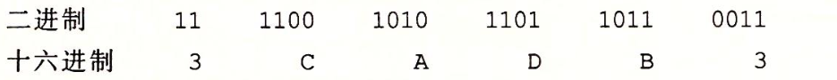
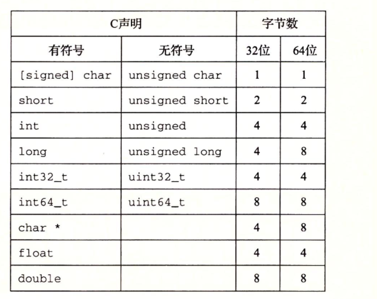

信息的表示和处理

[TOC]

### 信息的存储

+ 大多数计算机都是以一个**字节(8byte)**作为可寻址的内存空间. 
+ 应用程序将内存看作一个非常大的内存数组, 称为 **虚拟内存( virtual memory) **.
+ 内存中所有字节都由一个唯一数组标识 , 称为  **地址(address)** .
+ 所有的可能的地址的集合称为 **地址空间集合(virtual address space)**

> c 语言的指针的值都是某个存储块的第一个字节的的虚拟地址, c语言编译器根据指针类型生成不同的机器级代码来访问该存储块的值. 

#### 1.十六进制(hex)	

由于计算机存储是使用二进制存储.

使用二进制表示一个数会冗长, 使用10进制相互转换很麻烦,替代方案是使用以16作为基数的**十六进制**.  

十六进制由 0-9,A-F 十六个字符组成,以`0x`或者`0X`开头. 

**进制转换:**

+ 二进制转换16进制 :  将二进制以4个位分组,然后将4位组转换成对应的16进制的数字
   
+ 十六进制转二进制 

#### 2. 字长(word size)

由于**虚拟地址**是以一个字长来编码,所以计算机的**字长** 指定了指针数据的**标称大小(nominal size)**.

字长为 `w` 的计算机,虚拟地址的范围为 `0~2^w - 1` 程序对多访问 2^w 个字节.

**c语言数据类型的长度 :**

#### 3.寻址和字节顺序
+ 数据字节排列  : 多字节对象存在联系的字节序列中
+ 对象的地址     : 所用字节中最小的地址

数据字节排列方法: 
+ **小端法(litter endian)** : 从最低有效字节到最高有效字节的顺序储存对象
+ **大端法(litter endian)** : 从最高有效字节到最低有效字节的顺序储存对象

#### 4.表示字符串
C 语言中字符串 : 一个以 `\0`(值为0)字符结尾的字符数组

#### 5.表示代码 
不同的机器上二进制代码不兼容. 

#### 6.布尔 
将逻辑值TRUE和FALSE编码为二进制的1和0 
**布尔运算 :** 

#### 逻辑运算

逻辑运算认为所有非0的参数都是true,参数0位false 
返回 1 或者 0

####  C语言中的位移运算
+ 左移 : 丢弃最高的位,左边用0补齐; 
    例如 :  [Xw-1,Xw-2,...,X0] 左移 k位. 丢弃最高k位, 并在右端用0补齐, 结果为:[Xw-k-1,Xw-k-2,...,X0,0...0] 

 + 右移 
      + 逻辑右移 : 左端补k个0 结果为: [0,...,0,                             Xw-1,...Xk]

      + 算术右移 在左端补k个最高有效位的值

 **示例:** 

### 整数的表示

用位编码整数的两种不同的方式: 

+ 只能表示非负数(无符号数)
   + 编码 : 每个介于 0 ~ 2^w - 1 直接的数 都有唯一一个w位的编码.
+ 负数,0,和正数
  + 编码 : 以补码的形式编码 

强制类型转换: 

### 整数运算

​	+ 无符

### 浮点数 

IEEE 754 浮点数标准

IEEE 浮点标准用 V = (-1)^s x M  x 2 ^e 形式表示一共数 

+ 符号 s = 1 负数, s = 0  正数 

+ 尾数

+ 阶码 

  ​

