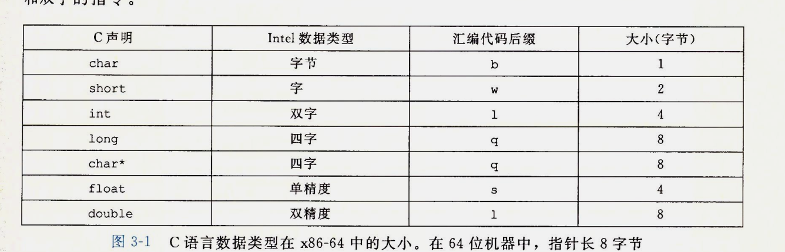

## 从c代码到机器码

机器级编程的两种抽象:

1.  对处理器的状态,指令的格式,指令对状态的影响抽象形成**指令集体系结构(Instruction Set Architecture,ISA)** 
    + 处理器能并发执行许多指令
    + 在并发执行的同时能保证**整体的行为**与**ISA指定的顺序执行的行为**完全一致.

2.  机器级程序使用的内存地址都是虚拟地址. 提供一个类似一共大的字节数组的内存模型.

**C语言的编译过程:** 将C语言提供的提供的抽象执行模型 转换成 处理器执行的最基本指令.
 编译形成的汇编语言比较接近机器代码,但比二进制机器代码更具有可读性. 

x86-64 的机器代码相对于c代码隐藏了处理器状态中
  + 程序计数器(PC) 在x86-64中用 `%rip` 表示.  给出要执行的下一条指令的地址. 
  + 整数寄存器.  
  + 条件码寄存器. 
  + 向量寄存器 

将c源程序编译成汇编代码 :  `gcc -Og mstroe.c`

> -Og 忽略优化

**mstore.c** 

```c  
long mult2(long,long);
void multstore(long x,long y, long *dest){
        long t = mult2(x,y);
        *dest = t;
}
```

编译后产生的汇编代码 : 

```assembly
multstore:
.LFB0:
        .cfi_startproc
        pushq   %rbx
        .cfi_def_cfa_offset 16
        .cfi_offset 3, -16
        movq    %rdx, %rbx
        call    mult2@PLT
        movq    %rax, (%rbx)
        popq    %rbx
        .cfi_def_cfa_offset 8
        ret
        .cfi_endproc

```

编译译成目标代码: `gcc -Og -c mstore.c`  

将机器码反编译成汇编代码: `objdump -d mstore.o` 

``` assembly
0000000000000000 <multstore>:
   0:   53                      push   %rbx
   1:   48 89 d3                mov    %rdx,%rbx
   4:   e8 00 00 00 00          callq  9 <multstore+0x9>
   9:   48 89 03                mov    %rax,(%rbx)
   c:   5b                      pop    %rbx
   d:   c3                      retq

```

+ x86-64 指令长度1到15个字节不等. 常用的指令和操作数少的指令需要的字节数少
+ 从某个给定的位置开始,可以将字节唯一的解码成机器指令
+ 反汇编器只是基于机器代码目标文件的字节序列生成确定的汇编代码. 和源码无关
+ 反汇编生成的指令名称与GCC生成的汇编代码使用的有细微的差别.  

## 数据格式

Inter术语 : **字(word)** 表示16位数据类型. 
32位 : 双字(double words )  64位 :`四字(全都words)`



大多数GCC生成的汇编代码指令都有一个字符后缀表明操作数的大小.        
数据传送指令的四个变种 : 

        + movb 传送字节
        + movw 传送字
        + movl   传送双字
        + movq  传送四字 

## Accessiong Information

x86-64 的CPU中包含 一组16个存储64位值的 **通用目的寄存器** ,用来存储 整数数据 和 指针 

| 63   | 31    | 15    | 7     | 0      |
| :--- | :---- | :---- | :---- | :----- |
| %rax | %eax  | %ax   | %al   | 返回值    |
| %rbx | %ebx  | %bx   | %bl   | 被调用者保护 |
| %rcx | %ecx  | %cx   | %cl   | 第4个参数  |
| %rdx | %edx  | %dx   | %dl   | 第3个参数  |
| %rsi | %esi  | %si   | %sil  | 第2个参数  |
| %rdi | %edi  | %di   |       | 第1个参数  |
| %rbp | %ebp  | %bp   |       | 被调用者保护 |
| %rsp | %esp  | %sp   |       | 栈指针    |
| %r8  | %r8d  | %r8w  | %r8b  | 第5个参数  |
| %r9  | %r9d  | %r9w  | %r9b  | 第6个参数  |
| %r10 | %r10d | %r10w | %r10b | 调用者保存  |
| %r11 | %r11d | %r11w | %r11b | 调用者保存  |
| %r12 | %r12d | %r12w | %r12b | 被调用者保存 |
| %r13 | %r13d | %r13w | %r13b | 被调用者保存 |
| %r14 | %r14d | %r14w | %r14b | 被调用者保存 |
| %r15 | %r15d | %r15w | %r15b | 被调用者保存 |

指令可以对这16个寄存器的低位字节中存放的不同大小数据进行操作
+ 字节操作可以访问最低字节
+ 16位操作可以访问最低2个字节
+ 32位操作可以访问最低4个字节
+ 64位操作 可以访问整个寄存器

### 操作数
大多数指令有一个或者多个**操作数(operand)**.

作用: 

   + 表示执行操作的数据源    
   + 放置运算结果的位置. 
     ​                                   
        类型: 

   + **立即数(immediate)**:  常数. 使用使`$`后加一个标准c的表示法的整数,例如 : `$-577`,`$0x1F`
   + **寄存器(register)** : 某个寄存器的内容.$r_a$表示任意寄存器$a$,R[r_a]$表示它的值. 
   + **内存引用(memory) reference** : 用 $M_b[Addr]$ 表示从地址$Addr$开始的$b$个字节的引用.


#### 寻址

| 类型   | 格式             | 操作数值                     | 名称        |
| ---- | -------------- | ------------------------ | --------- |
| 立即数  | $\$Imm$        | Imm                      | 立即数寻址     |
| 寄存器  | $r_a$          | $R[r_a]$                 | 寄存器寻址     |
| 存储器  | $Imm$          | $M[Imm]$                 | 绝对寻址      |
| 存储器  | $(r_a)$        | $M[R[r_a]]$              | 间接寻址      |
| 存储器  | $Imm(r_b)$     | M[Imm+R[r_b]]            | 基址+偏移量 寻址 |
| 存储器  | $(r_b,r_i)$    | $M[R[r_b] + R[r_a]]$     | 变址寻址      |
| 存储器  | $Imm(r_b,r_i)$ | $M[Imm+R[r_b] + R[r_a]]$ | 变址寻址      |
| 存储器  |                |                          |           |
| 存储器  |                |                          |           |
| 存储器  |                |                          |           |
| 存储器  |                |                          |           |


### 数据传送指令

将数据从一个位置复制到另一个位置的指令. 

MOV类:	

|       指令       |       效果        |   描述    |
| :------------: | :-------------: | :-----: |
|    MOV S,D     | $D\leftarrow S$ |   传送    |
|      movb      |                 |  传送字节   |
|      movw      |                 |   传送字   |
|      movl      |                 |  传送双字   |
|      movq      |                 |  传送四字   |
| movabsq  I , R | $R\leftarrow I$ | 传送绝对的四字 |


源(S)操作数:

+ 立即数
+ 存储在寄存器中的值
+ 存储在内存中的值

目的(D)操作数:

+ 寄存器的的位置
+ 内存地址

> x86-64 限制: 传送指令的两个操作数不能同时指向内存位置

> (16个)通用目的寄存器 作为MOV指令的操作数时,指令的最后一个字符('b','w','l'或者'q')指定操作数的大小.


MOV指令一般只会更新目的操作指定寄存器或者内存的位置, 但是 使用`movl`指令以寄存器作为操作数时,会将该寄存器的高位4个字节设置为0.

MOV指令的源操作数和目的操作数的可能组合: 

```assembly
1 	movl $ox4050,%eax	Immediate --> Register 		4 bytes
2	movw %bp,%sp		Register-->Register 		2 bytes
3	movb (%rdi,%rcx),%al	Memory -- > Register	1 byte
4	movb $-17,(%rsp)		Immediate --> Memory	1 byte
5   movq %rax,-12(%rbp)		Register-->Memory	    8 bytes
```

>  movq 当源操作数为立即数时,只能是以32位补码的数字,然后符号扩展到64位. 
>
>  movabsq 指令能以任意64位立即数作为源操作数, 只能以寄存器作为目的操作数 

**将较小的源数据复制到较大的目的操作数时:**

+ MOVZ 把目的操作数剩余字节用0填充

  |     指令      |          效果          |    描述    |
  | :---------: | :------------------: | :------: |
  | MOVZ  S , R | $R\leftarrow 零扩展(S)$ | 以零扩展进行传送 |
  |   movzbw    |                      |          |
  |   movzbl    |                      |          |
  |   movzwl    |                      |          |
  |   movzbq    |                      |          |
  |   novzwq    |                      |          |

  > 以内存地址或者寄存器为源操作数,以寄存器为目的操作数

+ MOVS 通过符号扩展填充,把源操作数的最高为进行复制 


|     效果      |              指令               |       描述       |
| :---------: | :---------------------------: | :------------: |
| MOVS  S , R |     $R\leftarrow 符号扩展(S)$     |    传送符号扩展字节    |
|   movsbw    |                               |                |
|   movsbl    |                               |                |
|   movswl    |                               |                |
|   movswq    |                               |                |
|   movslq    |                               |                |
|    cltq     | $\%rax\leftarrow 符号扩展(\%eax)$ | 把%eax符号扩展到%rax |

  > 以内存地址或者寄存器为源操作数,以寄存器为目的操作数
  >
  > cltq 指令只能作用于寄存器 $\%eax$ 和 $\%rax$

### 数据的**进栈**和**出栈**

## 算术和逻辑操作

操作整数和逻辑的指令分为四种:

+ 加载有效地址
+ 一元操作(一个操作数)
+ 二元操作(两个操作数)
+ 移位

|    指令    |         效果         |   描述   |
| :------: | :----------------: | :----: |
| lead S,D | D $\leftarrow$ &S  | 加载有效地址 |
|  INC D   | $D\leftarrow D +1$ |   加1   |
|  DEC D   |                    |   取负   |
|  NOT D   |                    |   取补   |

|             |                       |      |
| :---------: | :-------------------: | :--: |
| ADD    S,D  | D $\leftarrow$ D + S  |  加   |
| SUB    S,D  | D $\leftarrow$ D - S  |  减   |
| IMUL    S,D | D $\leftarrow$ D * S  |  乘   |
| XOR    S,D  | D $\leftarrow$ D ^ S  |  异或  |
|  OR    S,D  | D $\leftarrow$ D \| S |  或   |
| AND    S,D  | D $\leftarrow$ D & S  |  与   |

|            |                           |      |
| ---------- | ------------------------- | ---- |
| SAL    k,D | D $\leftarrow$ D << k     | 左移   |
| SHL    k,D | D $\leftarrow$ D << k     | 左移   |
| SAR    k,D | D $\leftarrow$ D >> $_A$k | 算术右移 |
| SHR    k,D | D $\leftarrow$ D >> $_L$k | 算术右移 |


###  加载有效地址


