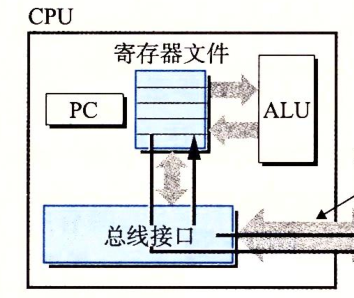
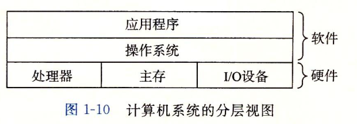
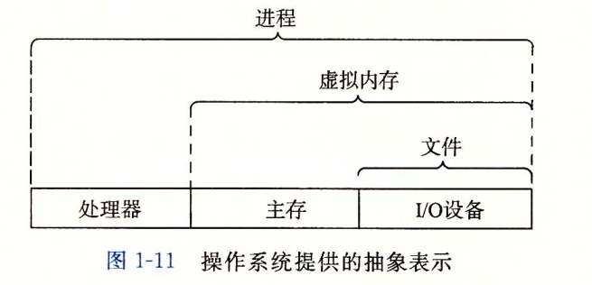

# 计算机漫游

[TOC]

> 计算机是用硬件和软件组成

系统中所有的信息,都是用一串比特来表示的.

## 编译

C语言程序要从源代码变成可执行的程序,每条c语句都必须被其他程序转化为一系列的低级的机器语言指令.然后这些指令按照一种称为*可执行目标程序*的格式打好包,并且以二进制的形式存放起来.

在Unix系统上从员文件到目标文件的转化由编译器驱动程序完成.
` linux> gcc -o hello hello.c `
从源代码到可执行文件的翻译过程需要四个阶段.执行这四个阶段的程序(预处理器,编译器,汇编器,链接器)组成了编译系统.

+ **预处理阶段**
  预处理器修改原始的C程序,处理以#开头的命令. 比如 处理 `#include <stdio.h>` 将系统中文件`stdio.h`的内容插入程序文本中得以`.i`为扩展名的程序

+ **编译阶段**
  编译器(ccl)将预处理处理后的.i文本翻译成一个包含汇编语言程序.
  例如:

```
	main:
	 subq	$8,%rsp
	 movl	$,LC0,%edi
	 call	puts
	 movl	%0,%eax
	 addq   %8m %rsp
	 ret   
```
+ **汇编阶段** 

  汇编器将汇编代码翻译成机器代码将结果保存在`.o`文件中

+ **链接阶段**
   将源码产生的`.o`文件和其调用其他库的`.o`文件合并产生_可执行目标    文件_

## 计算机的硬件组成

### 1.总线

+ **定义:**  贯穿整个系统的一组电子管道.
+ **作用:**  它携带信息字节在个部件中传递.

> 通常总线设置成传送定长的字节块. 称为字(word) . 
>
> 字的字节数(字长)是一个系统的基本参数通常 为 4 个字节或者8个字节

### 2.I/O设备

+ io设备是计算机系统和外接通信的联想通道. 

+ 每个IO设备都和**控制器**或者**适配器**相连. 

+ 再由 控制器和适配器 和IO总线 相连传递信息. 

  **图示:**

  

### 3.主存

+ **定义:** 一个临时存储设备 
+ **作用:** 在处理器执行程序时, 用来存放程序和程序处理的数据.


+ **物理上** :  由一组动态随机存取器(DRAM)芯片组成.
+ **逻辑上 :**  一个线性的字节数组,每个字节都有其唯一的地址.

### 4.处理器

+ **中央处理单元(CPU)** 简称处理器. 解释(执行) 存储在主存中的指令的引擎.  
+ 核心:一个字节大小的存储设备(寄存器).称为_程序计数器_;

> 任何时刻 **程序计数器(pc)**都指向主存中的一条机器语言指令. 

 **工作步骤:**   

+ 1.读取pc中指向的指令
+ 2.解释指令中的位 
+ 3.更pc指向下一条指令

> 指令 : 指令集(例如:x86,arm)中的指令.

> **寄存器文件:**由单个字长的**寄存器**组成.每个寄存器都有唯一名称.
>
> **算术/逻辑单元(ALU)** : 

​	**执行指令的操作:**

+ **加载** : 从**主存**中复制一个_字节_或者_字_到**寄存器**中,覆盖原来的内容.

+ **储存:** 从**寄存器**中复制一个_字节_或者_字_到主存中的某个位置上,覆盖这个位置原来的内容.

+ **操作:** 把两个**寄存器**中的内容复制到**ALU**中,**ALU**对两个字做算术运算,将结果复制到一个**寄存器**中,覆盖其原来的内容.

+ **跳转:** 从指令本身中抽取一个字,将这个字复制到程序计数器(PC)中,覆盖原来PC中的值.

  **图示:**

  

## 高速缓存

计算机的文件存在磁盘中.当CPU在运行中需要将主存中的指令读取放入pc中.

由于主存的访问速度非常慢如果直接从主存中读取内容到PC中会非常慢,从而导致系统运行慢. 在主存和pc寄存器之间加**高速缓存器**能很好的解决这个问题.	 

## 操作系统

操作系统是**应用软件**和**硬件**的中间层.软件访问硬件必须通过操作系统提供的服务.

操作系统功能:

+ 防止应用程序滥用硬件
+ 像应用软件提供简单,一致的访问硬件硬件的机制.

图示:



操作系统基本的抽象概念:

+ 进程
+ 虚拟内存
+ 文件

图示: 

 


### 进程 

+ 进程操作系统对正在运行的 应用程序的一种抽象.

操作系统上多个应用程序看起来是并发运行,单个CPU内核在某一时刻只能执行一共程序, 多个程序同时运行是通过出处理器在进程切换实现的. 

操作系统保持跟踪进程在运行是所有的状态信息(pc和寄存器文件的值,主存的内容...),这种状态称为 **上下文**   

在任意时刻单处理程序只能执行一个程序,当操作系统决定将控制权从当前进程传递到下一个进程,就会进行**切换上下文**;

**上下文切换:**

+ 保存当前进程上下文.
+ 恢复新的进程的上下文
+ 将控制器一脚到新的进程

### 线程

进程由多个线程组成.每个线程都运行在进程的上下文中,并且共享同样的代码和全局数据

### 虚拟内存

虚拟内存是操作系统为每个进程提供的一个独占主存的假象.

虚拟内存从低到高: 

+ **程序代码和数据** .对应所有进程,代码都是从一固定的地质开始. 紧接着的是c的全局变量相对应程序数据的位置. 代码和数据按照可执行文件的内容初始化. 
+ **堆** . 在程序代码和数据后紧接着是运行时堆.  堆可以动态扩展和收缩.
+ **共享库**  c标准库和数学库等共享库的代码和数据区域. 
+ **栈** 用户虚拟空间顶部的是用户栈. 
+ **内核虚拟空间** 为内核保留,不允许应用程序读写这个区域的内容.

### 文件

**本质:** 字节序列. 

